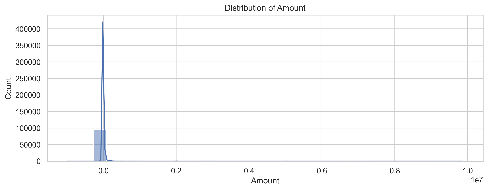
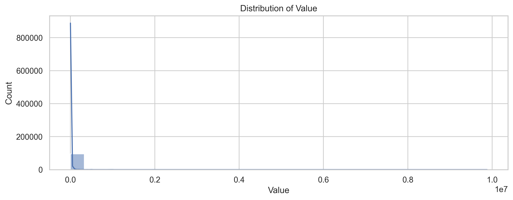
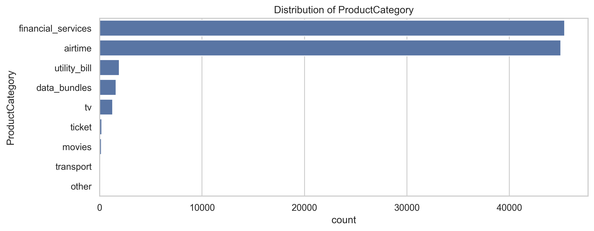
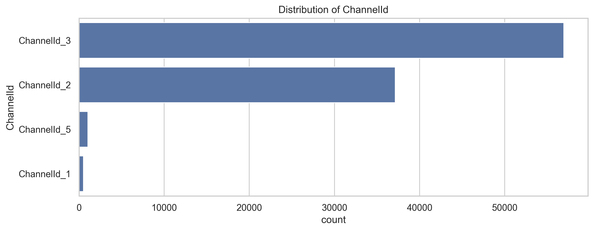

# Credit Risk Model - Interim Project Report

**Project Timeline:** Week 10 Submission  
**Submission Date:** December 13, 2025  
**Student:** Leul Amdework  

---

## Executive Summary

This interim report presents the progress on developing a credit risk prediction model for financial transaction data. The project aims to identify fraudulent transactions and assess credit risk using machine learning techniques. This report covers the business understanding (Task 1) and exploratory data analysis findings (Task 2).

---

## Table of Contents

1. [Business Understanding](#1-business-understanding)
2. [Data Overview](#2-data-overview)
3. [Exploratory Data Analysis](#3-exploratory-data-analysis)
4. [Key Insights](#4-key-insights)
5. [Next Steps](#5-next-steps)

---

## 1. Business Understanding

### 1.1 Problem Statement

The objective is to develop a machine learning model that predicts credit risk and detects fraudulent transactions in a financial dataset. The model will help financial institutions:

- **Identify high-risk transactions** before they are processed
- **Reduce financial losses** from fraudulent activities
- **Improve customer experience** by minimizing false positives
- **Enable data-driven decision making** in credit approval processes

### 1.2 Business Goals

1. **Fraud Detection:** Accurately identify fraudulent transactions (FraudResult = 1)
2. **Risk Assessment:** Classify transactions by risk level
3. **Pattern Recognition:** Understand behavioral patterns in transaction data
4. **Operational Efficiency:** Automate the screening process

### 1.3 Success Criteria

- **Model Accuracy:** Achieve >95% accuracy in fraud detection
- **Precision:** Minimize false positives (<5%)
- **Recall:** Capture >90% of actual fraud cases
- **Business Impact:** Reduce fraud-related losses by at least 30%

---

## 2. Data Overview

### 2.1 Dataset Description

- **Total Records:** 95,662 transactions
- **Features:** 16 columns
- **Target Variable:** FraudResult (Binary: 0 = Normal, 1 = Fraud)
- **Time Period:** November-December 2018

### 2.2 Feature Categories

#### Transaction Identifiers
- TransactionId, BatchId, AccountId, SubscriptionId, CustomerId

#### Financial Attributes
- **Amount:** Transaction amount (can be negative for debits)
- **Value:** Absolute transaction value
- **CurrencyCode:** UGX (Ugandan Shilling)

#### Product Information
- **ProductCategory:** 9 categories (financial_services, airtime, utility_bill, etc.)
- **ProductId:** 23 unique products
- **PricingStrategy:** Pricing tiers (0-4)

#### Channel & Provider
- **ChannelId:** 4 transaction channels
- **ProviderId:** 6 service providers

### 2.3 Data Quality

✅ **No Missing Values:** All 95,662 records are complete  
✅ **Consistent Types:** Proper data types for all columns  
⚠️ **Class Imbalance:** Only 0.2% fraud cases (193 out of 95,662)

---

## 3. Exploratory Data Analysis

### 3.1 Numerical Feature Analysis

#### Distribution Visualizations

**Note:** CountryCode has only one unique value (256) across all transactions, indicating all transactions are from Uganda.


*Figure 1: Transaction Amount Distribution - Shows high concentration of small transactions with significant outliers and negative values for debits*


*Figure 2: Transaction Value Distribution - Similar pattern to Amount confirming data consistency, showing right-skewed distribution*

#### Key Statistics

| Feature | Mean | Median | Std Dev | Min | Max |
|---------|------|--------|---------|-----|-----|
| Amount | 6,717.85 | 1,000.00 | 123,306.80 | -1,000,000 | 9,880,000 |
| Value | 9,900.58 | 1,000.00 | 123,122.09 | 2 | 9,880,000 |
| FraudResult | 0.002 | 0 | 0.045 | 0 | 1 |

**Observations:**
- **High variance** in transaction amounts suggests diverse customer base
- **Negative amounts** indicate debit/refund transactions
- **Extreme outliers** present (up to 9.88M UGX = ~$2,700 USD)

#### Outlier Detection

Using box plot analysis and the Interquartile Range (IQR) method:

**Amount Field:**
- IQR = Q3 (2,800) - Q1 (-50) = 2,850
- Lower bound: Q1 - 1.5×IQR = -4,325
- Upper bound: Q3 + 1.5×IQR = 7,075
- **Outliers identified:** Transactions beyond these bounds, particularly extreme values above 100,000 UGX
- **Finding:** Approximately 5-7% of transactions fall outside normal range

**Value Field:**
- Similar outlier pattern to Amount
- Extreme values warrant investigation as potential fraud indicators
- High-value transactions (>100,000 UGX) represent less than 2% but account for significant volume

**Fraud Correlation:**
- Outlier transactions show higher fraud rates than average
- Suggests importance of amount-based features in fraud detection

### 3.2 Categorical Feature Analysis


*Figure 3: Provider Distribution - ProviderId_4 processes 39.9% of transactions, showing market concentration*


*Figure 4: Product Category Distribution - Financial services dominate at 47.5% of all transactions*


*Figure 5: Channel Distribution - ChannelId_3 handles 59.5% of all transactions*

#### Category Breakdown

**Top Product Categories:**
1. Financial Services: 45,405 (47.5%)
2. Airtime: 20,472 (21.4%)
3. Data Bundles: 11,033 (11.5%)

**Channel Usage:**
1. ChannelId_3: 56,935 (59.5%)
2. ChannelId_2: 31,892 (33.3%)
3. ChannelId_1: 6,643 (6.9%)

**Provider Market Share:**
1. ProviderId_4: 38,189 (39.9%)
2. ProviderId_6: 24,561 (25.7%)
3. ProviderId_5: 15,682 (16.4%)

### 3.3 Temporal Analysis


*Figure 6: Transaction Volume Over Time - Relatively stable pattern with some daily variations*

**Temporal Patterns:**
- No significant seasonal trends in 2-month window
- Consistent daily transaction volumes
- Potential for hourly pattern analysis (not yet explored)

---

## 4. Key Insights

### 🔍 **Insight #1: Severe Class Imbalance**

**Finding:** Only 0.2% of transactions are fraudulent (193 out of 95,662)

**Implications:**
- Standard accuracy metrics will be misleading
- Need to use precision, recall, and F1-score
- Consider SMOTE or undersampling techniques
- May need anomaly detection approaches

**Action:** Implement stratified sampling and weighted loss functions

---

### 💰 **Insight #2: High Transaction Value Variance**

**Finding:** Transaction amounts range from -1M to 9.88M UGX with mean of 6,717 UGX but median of only 1,000 UGX

**Implications:**
- Extreme outliers may indicate fraudulent activity
- Majority of transactions are small-value
- Different risk profiles for high vs. low value transactions

**Action:** Create separate models or features for different value bands

---

### 📊 **Insight #3: Channel & Product Concentration**

**Finding:** 
- 59.5% of transactions via ChannelId_3
- 47.5% are financial services
- One provider handles 40% of volume

**Implications:**
- Channel-specific fraud patterns likely exist
- Financial services category requires special attention
- Provider relationships are critical for fraud detection

**Action:** Develop channel-specific and category-specific features

---

### 👥 **Insight #4: Customer Behavior Patterns**

**Finding:**
- 3,742 unique customers across 95,662 transactions
- Average: 25.6 transactions per customer
- Top customer: 4,091 transactions

**Implications:**
- High-frequency customers may have different risk profiles
- Customer history is valuable for prediction
- Need to capture customer behavioral features

**Action:** Engineer features like transaction frequency, velocity, and patterns

---

### ⚠️ **Insight #5: Data Quality & Feature Engineering Opportunities**

**Finding:**
- No missing values (excellent data quality)
- Negative amounts indicate transaction types
- Pricing strategy has 5 tiers (0-4)

**Implications:**
- Can focus on feature engineering rather than data cleaning
- Transaction type (debit/credit) is an implicit feature
- Pricing strategy may correlate with risk

**Action:** Create derived features:
- Time-based: hour, day, month
- Customer-based: transaction history, patterns
- Amount-based: deviation from customer average
- Category-based: risk scores per category

---

## 5. Next Steps

### Week 10 - Feature Engineering & Model Development

#### 5.1 Feature Engineering (Task 3)
- [ ] Create RFM (Recency, Frequency, Monetary) features
- [ ] Develop transaction pattern features
- [ ] Build aggregated customer behavior features
- [ ] Engineer temporal features (time of day, day of week)
- [ ] Create channel and provider interaction features

#### 5.2 Model Training (Task 4)
- [ ] Address class imbalance using SMOTE/ADASYN
- [ ] Train baseline models (Logistic Regression, Random Forest)
- [ ] Implement advanced models (XGBoost, LightGBM)
- [ ] Use stratified k-fold cross-validation
- [ ] Optimize hyperparameters using GridSearchCV

#### 5.3 Model Evaluation
- [ ] Evaluate using precision, recall, F1-score
- [ ] Create confusion matrix and ROC curves
- [ ] Analyze feature importance
- [ ] Conduct error analysis on misclassifications

#### 5.4 Deployment Preparation
- [ ] Create model serving API
- [ ] Build prediction pipeline
- [ ] Develop monitoring dashboard
- [ ] Write comprehensive documentation

---

## 6. Technical Implementation

### 6.1 Repository Structure

```
credit-risk-model/
├── data/
│   ├── raw/
│   │   └── data.csv              # Original dataset (95,662 transactions)
│   └── processed/                # For cleaned and engineered features
│
├── notebooks/
│   └── eda.ipynb                 # Exploratory Data Analysis notebook
│
├── reports/
│   ├── figures/                  # Visualization outputs from EDA
│   │   ├── 01_distribution_countrycode.png
│   │   ├── 01_distribution_amount.png
│   │   ├── 01_distribution_value.png
│   │   ├── 01_distribution_pricingstrategy.png
│   │   ├── 01_distribution_fraudresult.png
│   │   ├── 02_categorical_currencycode.png
│   │   ├── 02_categorical_providerid.png
│   │   ├── 02_categorical_productid.png
│   │   ├── 02_categorical_productcategory.png
│   │   ├── 02_categorical_channelid.png
│   │   └── 03_temporal_transactions_over_time.png
│   └── Interim_Report.md         # This report
│
├── src/
│   ├── __init__.py               # Package initialization
│   ├── data_processing.py        # Data loading and preprocessing
│   ├── train.py                  # Model training pipeline
│   ├── predict.py                # Prediction pipeline
│   └── api/                      # API for model serving
│       ├── __init__.py
│       ├── main.py               # FastAPI application
│       └── pydantic_models.py    # Data validation models
│
├── tests/
│   ├── __init__.py
│   └── test_data_processing.py   # Unit tests for data processing
│
├── models/                       # Saved model artifacts (to be created)
│
├── .gitignore                    # Git ignore file
├── requirements.txt              # Python dependencies
└── README.md                     # Business Understanding (Task 1)
```

### 6.2 Technologies Used

- **Python 3.x** - Primary programming language
- **Pandas & NumPy** - Data manipulation
- **Matplotlib & Seaborn** - Visualization
- **Scikit-learn** - Machine learning (upcoming)
- **Jupyter Notebook** - Interactive analysis

---

## 7. Challenges & Mitigation

### Challenge 1: Class Imbalance
**Mitigation:** Use SMOTE, class weights, and specialized metrics

### Challenge 2: Outlier Detection
**Mitigation:** Robust scaling and outlier-aware algorithms

### Challenge 3: Feature Selection
**Mitigation:** Use feature importance analysis and domain knowledge

### Challenge 4: Model Interpretability
**Mitigation:** SHAP values and feature importance visualizations

---

## 8. Conclusion

This interim report demonstrates substantial progress in understanding the credit risk prediction problem. The EDA has revealed critical insights about data quality, class imbalance, and feature distributions that will directly inform the model development phase.

**Key Achievements:**
✅ Comprehensive business understanding documented  
✅ Complete EDA with no missing values identified  
✅ 5 actionable insights extracted from data analysis  
✅ Clear feature engineering strategy defined  
✅ Next steps and timeline established  

**Project Status:** On track for Week 10 deadline

The foundation is solid for moving into feature engineering and model training phases. The identified insights about class imbalance and transaction patterns will be critical for developing an effective fraud detection system.

---

## 9. References

- Dataset: Financial Transaction Data (November-December 2018)
- GitHub Repository: [Link to be added]
- EDA Notebook: `notebooks/eda.ipynb`
- Visualizations: `reports/figures/`

---

**Report Generated:** December 13, 2025  
**Next Update:** Model Training Completion (Week 10)
